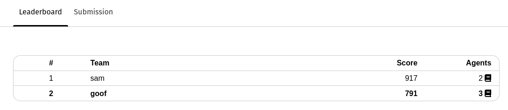
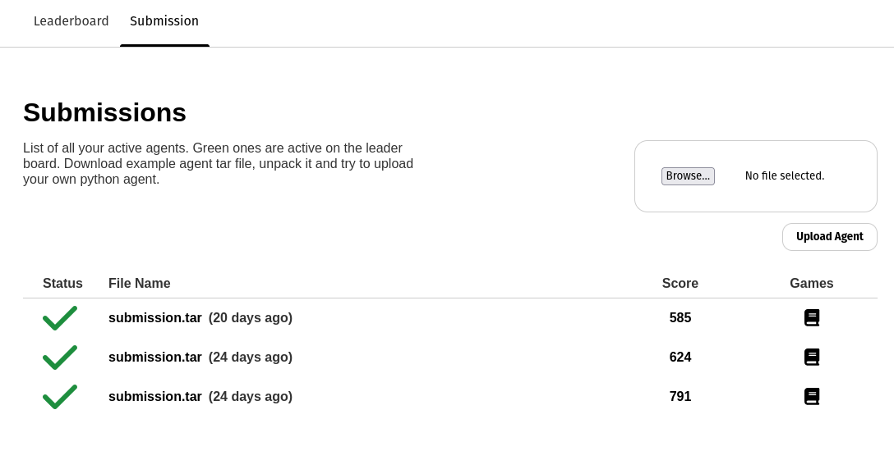
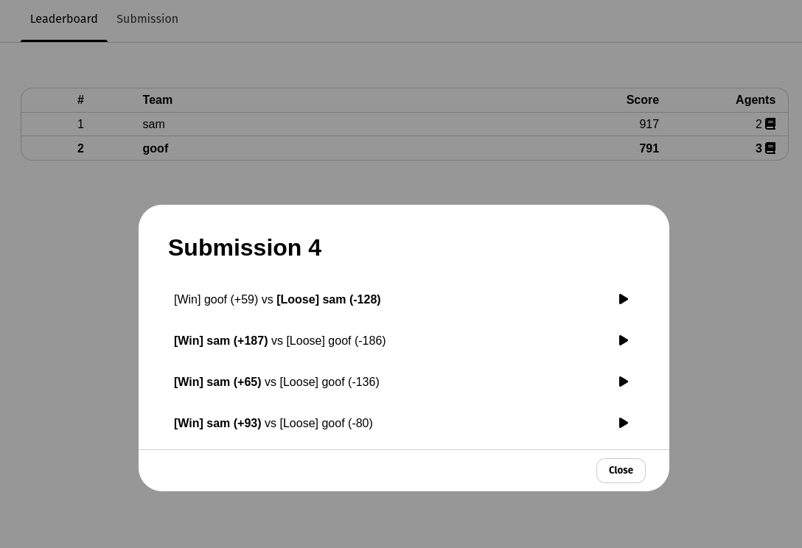
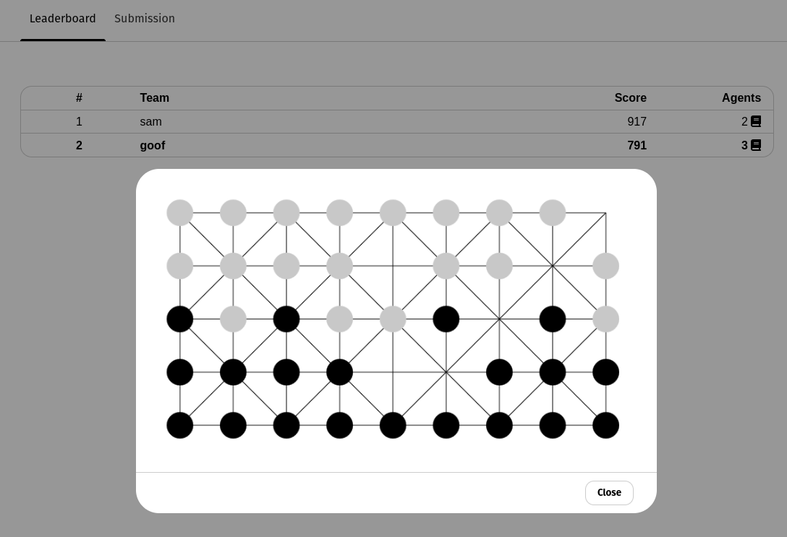

# Epoch game RL competition
**Duration:** 1 day (8 hours) \
**Location:** Dreamhall \

### Description
Goal of competiton will be to create best AI agents for board game [`Fanorona`](https://www.mindsports.nl/index.php/the-pit/528-fanorona), like a gypsy version of checkers. All AI agents submitted by participants going to play againts each other inside of my match making system `https://github.com/magisterbrown/mono-smesh`. After some amount of calibration games every agent will get place on the leaderboard. Agent on top of the leaderboard in the end will be a winner.

**Leaderboard:** \


### Teams
We can split everyone who signs up in a teams of 2, so not engineers can also participate. Winning team will get bottle of [`Jager`](https://www.jagermeister.com/en) from me, because no one wants to drink it now.

### Agents
Agents will work as shell applications that accept a game state and respond with a move. It will also have a Dockerfile that describes environment where agent should execute, so participants can implement agent in any language. Thinking time per turn will be limited for ai agent by like 3 seconds. Example agent will be provided inside web app that is written in python and does random moves. Also we will use library with python implementation of the game for local development `https://github.com/AbhijeetKrishnan/fanorona-aec`. If agent makes illegal move or does not make a decision on time it is banned from the competition, but team that created it could still submit other agents to leaderboard. Raiting of the best agent per team will determine teams place on the leaderboard.

**Submission page:** \ 

 \

**History of agent games:**

 \

**Recording animation of every game:**

 \

**Agent that does random move example:** \
```python
import random
import argparse
from fanorona_aec.env.fanorona_move import FanoronaMove
from fanorona_aec.env.fanorona_state import FanoronaState

parser = argparse.ArgumentParser()
parser.add_argument("--observation")
args = parser.parse_args()

def agent(state):
    res = random.choice(state.legal_moves)
    return res

if __name__=='__main__':
    board = args.observation
    state = FanoronaState()
    print(agent(state.set_from_board_str(board)))
```


### Bonus
Duration of the competition will be too short to implement actual RL learing AIs. But I can do a workshop how to implement Alpha Zero for similar games. For example 4 in a row.
